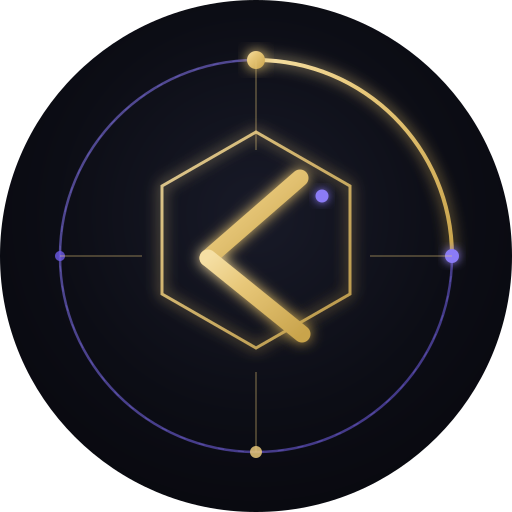

# 🎨 KIRO Avatar Pack

Set avatar **dark gold-violet** untuk bot Telegram & web app — dibuat murni dari **SVG**,
tanpa tool desain. Tema konsisten: latar gelap, aksen emas `#E8C87A` + ungu `#8B7CF6`.



---

## 📦 Isi

| Folder | Isi | Ukuran |
|---|---|---|
| `svg/` | **Sumber SVG** (edit di sini) | 24 KB |
| `png/` | Render 256/512 px | ~400 KB |
| `jpg/` | Siap upload Telegram (RGB) | ~145 KB |
| `anim/` | **MP4 animasi** (rotate orbit + glow) | 428 KB |
| `favicon/` | Favicon set (SVG + ICO + PNG 16→512) | 60 KB |
| `pwa/` | PWA icons (any + maskable) + iOS splash | 90 KB |
| `og/` | Open Graph 1200×630 | 160 KB |

**Total: 1.5 MB · 36 file**

---

## 🎭 4 Avatar

| Avatar | Desain | Warna |
|---|---|---|
| **KIRO** | Heksagon + monogram **K** + orbit + node | gold `#E8C87A` |
| **OpenClaw** (Vesper 🦞) | Lobster + capit + mata ungu | coral `#E86A4C` |
| **Hermes** | Kadukeus + sayap + ular | cyan `#4FD1C5` |
| **Helix** | Double-helix DNA + rungs | magenta `#E879D8` |

---

## 🚀 Cara Pakai

### 1. Telegram bot (static)

```bash
TOKEN="<bot-token>"
curl -X POST "https://api.telegram.org/bot$TOKEN/setMyProfilePhoto" \
  -F 'photo={"type":"static","photo":"attach://f0"}' \
  -F "f0=@jpg/kiro.jpg"
```

### 2. Telegram bot (ANIMATED)

```bash
curl -X POST "https://api.telegram.org/bot$TOKEN/setMyProfilePhoto" \
  -F 'photo={"type":"animated","animation":"attach://f0"}' \
  -F "f0=@anim/kiro.mp4"
```

> ⚠️ **Format `InputProfilePhoto` JSON wajib** — `-F "photo=@file.jpg"` akan gagal
> dengan `"photo isn't specified"`.
>
> ⚠️ MP4 wajib **`-pix_fmt yuv420p`**.

### 3. Favicon web

```html
<link rel="icon" type="image/svg+xml" href="/favicon.svg">
<link rel="icon" type="image/x-icon" href="/favicon.ico">
<link rel="apple-touch-icon" href="/favicon-180.png">
```

### 4. PWA manifest

```json
{
  "name": "My App",
  "display": "standalone",
  "theme_color": "#07070C",
  "icons": [
    { "src": "/icon-192.png", "sizes": "192x192", "purpose": "any" },
    { "src": "/icon-512.png", "sizes": "512x512", "purpose": "any" },
    { "src": "/icon-192-maskable.png", "sizes": "192x192", "purpose": "maskable" },
    { "src": "/icon-512-maskable.png", "sizes": "512x512", "purpose": "maskable" }
  ]
}
```

### 5. Open Graph

```html
<meta property="og:image" content="/og-image.png">
<meta property="og:image:width" content="1200">
<meta property="og:image:height" content="630">
<meta name="twitter:card" content="summary_large_image">
```

---

## 🎨 Palet

```css
--bg:      #07070C   /* latar utama */
--surface: #12131E   /* kartu */
--line:    #232538   /* border */

--gold:    #E8C87A   /* aksen utama */
--gold-2:  #C9A44C
--gold-hi: #F5DFA4

--violet:  #8B7CF6   /* aksen sekunder */
--violet-2:#6D5AE6
```

---

## 🛠️ Render Ulang

Butuh **`rsvg-convert`** (librsvg) + **ImageMagick** + **ffmpeg**:

```bash
# SVG -> PNG
rsvg-convert -w 512 -h 512 svg/kiro.svg -o png/kiro-512.png

# PNG -> JPG (RGB, wajib untuk Telegram)
convert png/kiro-512.png -background '#07070C' -flatten jpg/kiro.jpg

# ICO multi-size
convert favicon/favicon-16.png favicon/favicon-32.png favicon/favicon-48.png favicon/favicon.ico
```

**Animasi** (rotate orbit + glow breathing) — lihat `tools/make-anim.py`:

```bash
python3 tools/make-anim.py kiro "232,200,122"
ffmpeg -y -i anim/kiro.gif -pix_fmt yuv420p -r 20 anim/kiro.mp4
```

---

## 📐 Catatan Desain

**Maskable icon** — Android adaptive icon memotong tepi. Konten wajib dalam
**safe zone 80%**:

```svg
<g transform="translate(256,256) scale(0.62) translate(-256,-256)">
  <!-- konten di sini -->
</g>
```

**Avatar Telegram di-crop lingkaran** — taruh elemen penting di tengah (radius ~45%).

---

## 📄 Lisensi

MIT — pakai bebas, modifikasi sesuka hati.

Dibuat dengan **KIRO AGENTIC** di Termux/Android tanpa tool desain.
